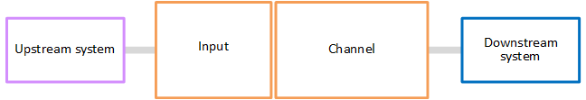
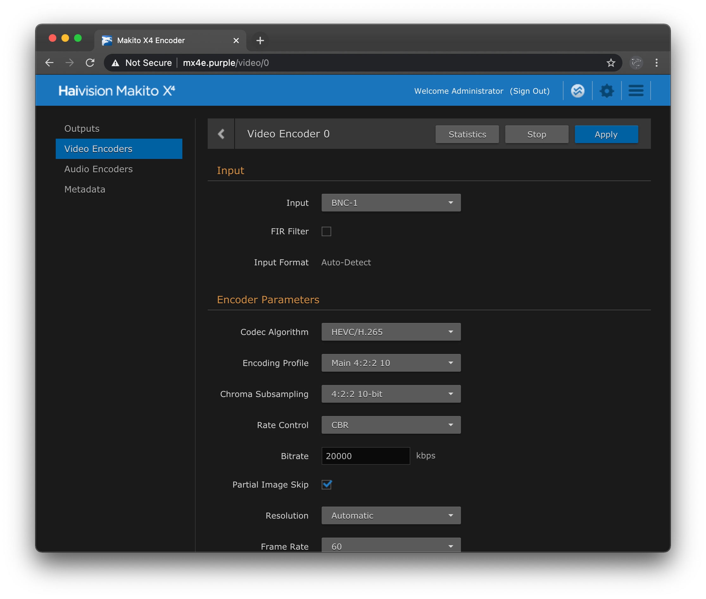
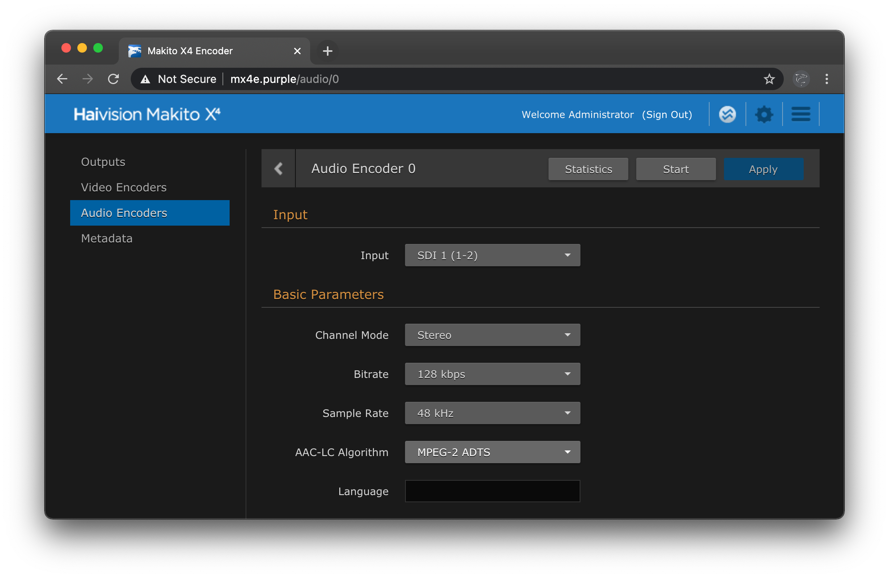
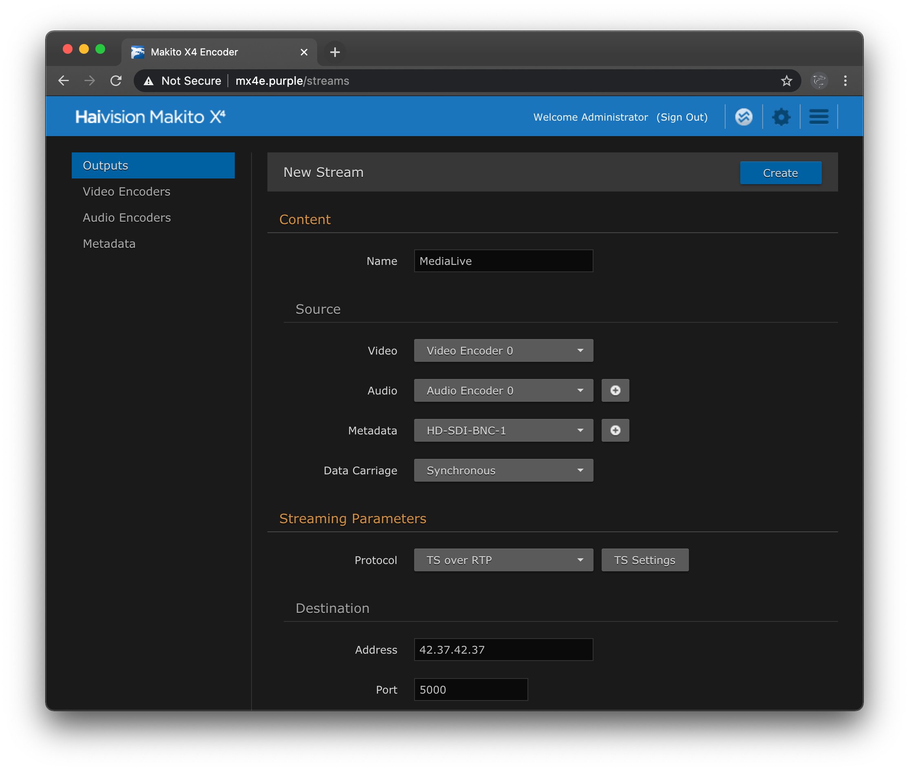

# Streaming with the Haivision Makito X4 Encoder and AWS Elemental MediaLive

This provides a brief guide for configuring an `RTP_PUSH` input video stream for MediaLive, a channel for MediaLive and MediaPackage to exchange video data, and details for configuring a [Haivision Makito X4 Video Encoder](https://www.haivision.com/products/makito-series/makito-x4-video-encoder/) to stream into the cloud via [AWS Elemental MediaLive](https://aws.amazon.com/medialive/) using RTP.

Instructions are broken into two sections.  The first configures the AWS cloud media pipeline for ingest via MediaLive, and distribution via MediaPackage.  The second configures the Makito X4 Encoder for contribution into the AWS Elemental MediaLive RTP input.
-  [AWS Elemental MediaLive Configuration](#aws-elemental-medialive-configuration)
    1. [Create an AWS Elemental MediaLive Input](#1-create-an-aws-elemental-medialive-input)
    2. [Create an AWS Elemental MediaPackage Channel](#2-create-an-aws-elemental-mediapackage-channel)
    3. [Create an AWS Elemental MediaLive Channel](#3-create-the-aws-medialive-channel)

- [Configure the Makito X4 Encoder](#configure-the-maktio-x4-encoder)
    1. [Configure the Video Encoder](#1-configure-the-video-encoders)
    2. [Configure the Audio Encoder](#2-configure-the-audio-encoders)
    3. [Configure and Start the Output Stream](#3-configure-the-outputs)
<br><br>

# AWS Elemental MediaLive Configuration
An AWS Elemental MediaLive channel has two dependencies, an input and an output.  The example code with noted adjustments for for RTP sources will create a MediaLive input and will use a HLS output to an AWS Elemental MediaPackage channel.  For a full list of possible outputs, see the [MediaLive documentation](https://docs.aws.amazon.com/medialive/latest/ug/what-is.html), and in particular [How MediaLive Works](https://docs.aws.amazon.com/medialive/latest/ug/how-medialive-works-channels.html).



Here, the `Upstream system` is the Makito X4 (with configuration further below), the `Input` is created in step 1, the `Downstream system` is the MediaPackager channel created in step 2, and the `Channel` is created in step 3.

Be sure to review the core set of [AWS Media Services Compatability Program](https://aws.amazon.com/media-services/resources/compatibility/) examples for creating [MediaLive channls and inputs](https://github.com/aws-samples/aws-media-services-tools/tree/master/MediaLive/Compatibility/Examples) as well as those for [configuring MediaPackage channels](https://github.com/aws-samples/aws-media-services-tools/tree/master/MediaPackage/Compatibility/Examples).
<br><br>

---
## 1. Create an AWS Elemental MediaLive Input

Leverage the Python script below to create a MediaLive Input:
- [Create_MediaLive_Input.py](https://github.com/aws-samples/aws-media-services-tools/tree/master/MediaLive/Compatibility/Examples/Create_MediaLive_Input.py) 
<br><br>

This script expects an `input` data structure with the following for `RTP_PUSH` inputs:
Parameter | Notes
------------ | -------------
ID | A unique name for the MediaLive resources
input_type | The type of MediaLive input that you are creating.  Use `RTP_PUSH` for the Makito.
<br>

An example `input` block for the MediaLive Input script is below:
```Python
input = {
    "Input": {
      "ID":         "Makito X4 Encoder Source",
      "input_type": "RTP_PUSH"
  }
}
```
<br><br>

---
## 2. Create an AWS Elemental MediaPackage Channel

Leverage the Python script below to create the MediaPackage Channel for stream playback:
- [Create_MediaPackage_Channel.py](https://github.com/aws-samples/aws-media-services-tools/tree/master/MediaPackage/Compatibility/Examples/Create_MediaPackage_Channel.py)
<br><br>

This script expects an `event` data structure with the following:
Parameter | Notes
------------ | -------------
ID | A unique name for the MediaPackage resources
<br>

This script will return a JSON data structure with the MediaPackage destination information, note the values, because they will be needed next to create the MediaLive Channel

Set the `event` variable as follows:
```Python
event = {
  "ID": "Makito X4 Encode Channel"
}
```
<br><br>

---
## 3. Create the AWS MediaLive Channel
To create the MediaLive Channel, use either the Python script or AWS Lambda-optimized code below
- [Create_MediaLive_Channel.py](https://github.com/aws-samples/aws-media-services-tools/tree/master/MediaLive/Compatibility/Examples/Create_MediaLive_Channel.py)

This script expects an input data structure with the following:
Parameter | Notes
------------ | -------------
ID | A unique name for the MediaLive resources
input_id | The output of the MediaLive input creation
destination_id | The output of the MediaPackage channel creation
medialive_arn | The ARN for the IAM role that the MediaLive channel will use

An example MediaLive channel JSON is below:

```JSON
{
  "ID": "Makito X4 Encode Channel",
  "input_id": "Makito X4 Encoder Source",
  "destination_id": {
      "Username":  "user 1",
      "Password":  "credentials",
      "URL1":      "destination url 1"
  },
  "medialive_arn": "AWS ARN for MediaLive to use"
}
```
<br><br>


# Configure the Makito X4 Encoder
The Haivision Makito X4 Video encoder is a low-latency HEVC and H.264 video encoder supporting HD and 4K HUD sources. Use and configration of the Makito X4 is found in the [Makito Product documentation](https://doc.haivision.com/Makito). Select Makito X4 Encoder for detailed guidance beyond what's shown here.

Once the AWS Elemental Media Services components are running, note the IP address and port of the MediaLive RTP input.  The RTP URL will resemble the following structure:
```
rtp://[ip address]:[port]
```
Parameter | Notes
------------ | -------------
ip address | The MediaLive RTP input IP address
port | The MediaLive RTP input port (default of 5000)
<br><br>

## 1. Configure the Video Encoders
Navigate to `Video Encoders` on the left navigation area:


MediaLive is capable of accepting streams with any underlying codec, yet special consideration should be made on the Makito `Codec Algorithm` selected as other AWS Elemental Media Services consuming media from MediaLive, such as MediaPackage, require reinitialization when an incomming video stream switches to a different video codec.

The Makito encoder is capable of producing both H.264 and HEVC encoded streams with `Encoding Profile` and `Chroma Subsampling` up to 4:2:2 10-bit.  

MediaLive can accept encoded streams for frame sizes in SD, HD, and UHD resolutions.  Be sure to match the Makito's Encoded output `Resolution` to match the configuration of MediaLive as specified in [step 1](#1-create-an-aws-elemental-medialive-input).

Other encoding parameter selections are left to the user to define, tweak, and refine for the use case at hand.  Refer to the [Makito Product documentation](https://doc.haivision.com/Makito) for further explanation of parameters and usage of the Makito X4 Video Encoder.
<br><br>

## 2. Configure the Audio Encoders
Navigate to `Audio Encoders` on the left navigation area:


Adjust the Audio Encoder parameters to match the Maktio X4 installation environment.  One or more Audio Encoders can be associated with a single Output Stream as defined in the next step.
<br><br>

## 3. Configure the Outputs
Navigate to `Outputs` on the left navigation area:


Select the `(+)` icon to create a new Output stream.

On the `New Stream` creation page, specify a new `Name` for the stream.  `MediaLive` is used in this example.

Next, select the `Video`, `Audio`, and `Metadata` sources for this stream.  If a metadata source is selected, also specify the `Data Carriage` method for the metadata source.  MediaLive can be configured via  the [M2tsSettings API](https://docs.aws.amazon.com/medialive/latest/apireference/channels.html#channels-model-m2tssettings) to retain and forward the KLV metadata embedded by the Makito X4 Encoder. 

For the Streaming Paramters, select a `Protocol` of `TS over RTP`.

For the `Destination`, set the `Address` field to match the MediaLive `ip address`, and set the `Port` to match the MediaLive `port`.

Finally select the `Create` button, and then the `Start` button to begin streaming to MediaLive.

Confirm that the AWS Media Services pipeline is performing as expected by inspecting the console, and observing the segmented output stream from MediaPackage in a web browser.
<br><br>
