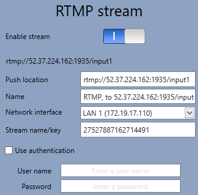
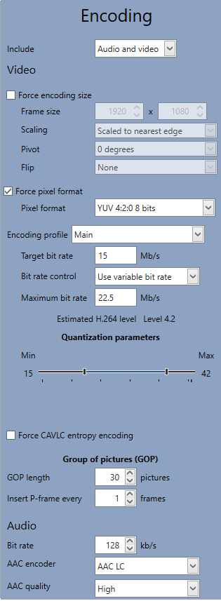
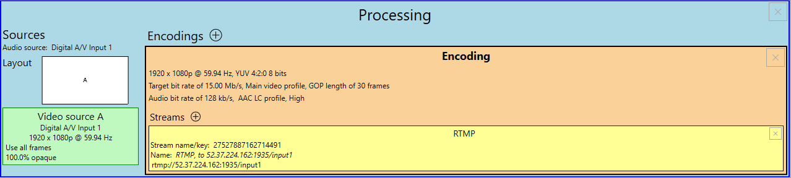

# RTMP Streaming with Matrox Monarch EDGE and AWS MediaLive

How to connect Elemental Live to a MediaLive channel using RTMP Push

1. [Create a MediaLive Input](#1-create-the-medialive-input)
2. [Create a MediaPackage Channel for playback](#2-create-a-mediapackage-channel-for-playback-of-the-medialive-stream)
3. [Create the MediaLive Channel](#3-create-the-medialive-channel)
4. [Configure Monarch EDGE Transcoder](#4-configure-monarch-edge)

## Detailed Instructions and Examples

An AWS Elemental MediaLive channel has two dependencies, an input and an output.  The example code below will create a MediaLive input and will use a HLS output to an AWS Elemental MediaPackage channel.  For a full list of possible outputs, see the MediaLive documentation available [here](https://docs.aws.amazon.com/medialive/latest/ug/creating-a-channel-step5.html).

### 1. Create an AWS Elemental MediaLive input

#### To create the MediaLive input, use either the Python script or AWS Lambda-optimized code below

- [Create_MediaLive_Input.py](https://github.com/aws-samples/aws-media-services-tools/tree/master/MediaLive/Compatibility/Examples/Create_MediaLive_Input.py)
- [MediaLive Input Lambda](https://github.com/kulpbenamazon/aws-samples/aws-media-services-tools/tree/master/MediaLive/Compatibility/Examples/Lambda_Create_MediaLive_Input.py)
- [Example RTMP_PUSH Input JSON](https://github.com/aws-samples/aws-media-services-tools/tree/master/MediaLive/Compatibility/Examples/MediaLive_Input.json)

##### Both scripts expect an input dictionary that contains the following information

Parameter | Notes
------------ | -------------
ID | A unique name for the MediaLive resources
input_type | The type of MediaLive input that you are creating [:one:](#notes)
source_urls | An array of source URLs from which MediaLive will pull content [:two:](#notes)
bitrate | The expected bitrate of the stream [:three:](#notes)
resolution | The expected resolution of the stream [:four:](#notes)
mediaconnect_flows | An array of ARNs (Amazon Resource Names) for the AWS Elemental MediaConnect flows [:five:](#notes)

##### Both scripts will return the MediaLive Input ID, note the value, because it is needed to create the MediaLive Channel

### 2. Create an AWS Elemental MediaPackage channel

#### To create the MediaPackage channel for stream playback, use either the Python script or AWS Lambda-optimized code below

- [Create_MediaPackage_Channel.py](https://github.com/aws-samples/aws-media-services-tools/tree/master/MediaPackage/Compatibility/Examples/Create_MediaPackage_Channel.py)
- [Create MediaPackage Lambda](https://github.com/aws-samples/aws-media-services-tools/tree/master/MediaPackage/Compatibility/Examples/Lambda_Create_MediaPackage_Channel.py)
- [Example Input JSON](https://github.com/aws-samples/aws-media-services-tools/tree/master/MediaPackage/Compatibility/Examples/MediaPackage_Channel.json)

##### Both scripts expect an input dictionary that contains the following information

Parameter | Notes
------------ | -------------
ID | A unique name for the MediaPackage resources

##### Both scripts will return a JSON data structure with the MediaPackage destination information, note the values, because they will be needed to create the MediaLive channel

### 3. Create the MediaLive Channel

#### To create the MediaLive channel, use either the Python script or AWS Lambda-optimized code below

- [Create_MediaLive_Channel.py](https://github.com/aws-samples/aws-media-services-tools/tree/master/MediaLive/Compatibility/Examples/Create_MediaLive_Channel.py)
- [MediaLive Channel Lambda](https://github.com/aws-samples/aws-media-services-tools/tree/master/MediaLive/Compatibility/Examples/Lambda_Create_MediaLive_Channel.py)
- [Example MediaLive channel creation JSON](https://github.com/aws-samples/aws-media-services-tools/tree/master/MediaLive/Compatibility/Examples/MediaLive_Channel.json)

##### Both scripts expect an input data structure that contains the following information

Parameter | Notes
------------ | -------------
ID | a unique name for the MediaLive resources
input_id | the output of the MediaLive input creation
destination_id | the output of the MediaPackage channel creation
medialive_arn | The ARN for the IAM role that the MediaLive channel will use

### 4. Configure Monarch EDGE

- Monarch EDGE [product information](https://www.matrox.com/video/en/products/monarch_edge/)
- Monarch EDGE [product documentation](https://www.matrox.com/video/en/support/downloads/download/?id=250&product=118&osName=28&productName=monarch_edge&downloadType=Documentation)

The MediaLive input creation will provide two input URLs with the following structure:

```raw
rtmp://[ip address 1]:1935/input1/[channel id]
rtmp://[ip address 2]:1935/input2/[channel id]
```

For the RTMP settings in the Monarch EDGE device, users only have to enter information in the push location field, stream key field and and select which network interface to send the stream out of using the dropdown.  The name field gets generated automatically and is just used for identification within the Monarch EDGE control hub software.



Note: Use the first RTMP Input provided for primary encoder. Repeat if using a backup Monarch EDGE unit with the secondary RTMP Input.

Please use the following settings in the Monarch EDGE interface for best results:



Note: Encoding settings can be adjusted for environment and desired results, thses settings are a guideline and a great starting point.

The following example process shows what the overall process should look like once setup and the two other screens show how to configure the RTMP push location as well as the encoding settings using settings suggested above.



### Notes

:one: Valid MediaLive input values are: `'RTP_PUSH' | 'RTMP_PUSH' | 'RTMP_PULL' | 'URL_PULL' | 'MP4_FILE' | 'MEDIACONNECT'`\
:two: This parameter is only needed for the following input types: `'RTMP_PULL' | 'URL_PULL' | 'MP4_FILE'` \
:three: Valid bitrate values are: `'MAX_10_MBPS' | 'MAX_20_MBPS' | 'MAX_50_MBPS'` \
:four: Valid resolution values are: `'SD' | 'HD' | 'UHD'` \
:five: See [MediaConnect Flow Creation](http://github.com/aws-samples/aws-media-services-tools/tree/master/MediaConnect/Compatibility/Examples/') and [MediaConnect Product Information](https://aws.amazon.com/mediaconvert/) for more information on using AWS Elemental MediaConnect
